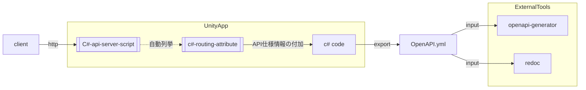

# usimplehttpserver : SimpleHttpServer for Unity

!!現在実験的に開発中!!
Unityアプリにシンプルなhttp APIサーバー機能を持たせるためのpackageです。

アプリAPIにより他アプリと柔軟に組み合わせ利用できるようにします。
例えば以下のような用途があります。
- Webブラウザ, Curl等からアクセスすることでアプリ操作・クエリできる
- APIを用いたE2Eの自動テストに使う (gaugeのサンプルを添付しています)
- openapi.yml エンドポイントからAPI仕様を取得してドキュメントを作成する
- openapi.yml エンドポイントからAI系ツールに情報提供することでAIからアプリ制御しやすくする
- elgato StreamDeck 等のデバイスへAPI呼び出しボタンを設定することでアプリのショートカット実行に対応する

## Concept

- Unityアプリの既存コードを簡素な手順でAPI公開
- APIを通して他アプリとの連動性を得る
- OpenAPI.ymlを通して既存のWeb開発圏のツール・手法を流用可能にする

**やらないこと**

- シンプル。APIサーバー機能のみを扱うことにし、静的ファイル、テンプレートエンジン他、多様な機能を持つ一般的なWebサーバーを目指さない。
- 単独でAPIをインターネット公開できるレベルのセキュリティ確保を目指さない。
  - 基本的にはユーザー自身がローカルPC上で用いるのを想定しています。
- Webブラウザ等からの要求に完全対応するのを目指さず、省略可能なものは極力省略します。



## Installation

### dependencies

先に以下をimportしておいてください。

- com.cysharp.unitask
  - インストール方法は公式 https://github.com/Cysharp/UniTask.git を参照ください。

- com.unity.nuget.newtonsoft-json
  - Package Managerを開き、Install package by name... から com.unity.nuget.newtonsoft-json をインストールします。


### upm

本パッケージは Package Managerを開き、Install package from git URL... から以下をインストールします。

```
https://github.com/uisawara/usimplehttpserver.git?path=Assets/UnityPackages/mmzkworks.usimplehttpserver
```

## コード例

### サーバーの起動・停止

```c#
public sealed class SimpleHttpServerBehaviour : MonoBehaviour
{
    [SerializeField] private int port = 8080;
    private SimpleHttpServer? server;

    private void Awake()
    {
        DontDestroyOnLoad(gameObject);

        // HttpServerの起動
        server = new SimpleHttpServer(port);
        // AttributeをもとにしたController登録 (ルーティング設定)
        server.RegisterControllersFrom(Assembly.GetExecutingAssembly());
        server.Start();
    }

    private void OnDestroy()
    {
        // HttpServerの停止
        server?.Stop();
        server = null;
    }
}
```

### URIルーティング設定

- Attribute設定によりルーティング定義を行います。
- URLパラメータはメソッド定義と紐づけされます。

```c#
[RoutePrefix("/api")]
public sealed class DemoController
{
    // GET /api/echo/hello?times=3 -> "hellohellohello"
    [HttpGet("/echo/{text}")]
    public string Echo(string text, int times = 1)
    {
        return string.Concat(Enumerable.Repeat(text, Math.Max(1, times)));
    }

    // GET /api/add/12/30 -> { "a":12, "b":30, "sum":42 }
    [HttpGet("/add/{a}/{b}")]
    public object Add(int a, int b)
    {
        return new { a, b, sum = a + b };
    }

    // POST /api/users  Body: {"name":"Alice","age":20}
    [HttpPost("/users")]
    public User CreateUser([FromBody] User req)
    {
        return new User { Id = Guid.NewGuid(), Name = req.Name, Age = req.Age };
    }

    // GET /api/users/{id}
    [HttpGet("/users/{id}")]
    public User GetUser(Guid id)
    {
        return new User { Id = id, Name = "Sample", Age = 42 };
    }
}

public sealed class User
{
    public Guid Id { get; set; }
    public string Name { get; set; } = "";
    public int Age { get; set; }
}
```

## Sample code

upmにサンプルコードが付属しています。
Unity EditorでPackage Managerからインポートすることができます。

### ApplicationStateApiSample

幾つかのサンプルAPI実装が入っています

| APIエンドポイント | レスポンス                                                   |
| ----------------- | ------------------------------------------------------------ |
| /api/echo/{text}  | textで指定されたテキストをエコーバックで返します。           |
| /api/state        | アプリ状態一式をJSON形式で取得します。                       |
| /api/state/{key}  | 種類を指定してアプリ状態をJSON形式で取得します。<br />keyには以下が使えます。<br />application: アプリ基本情報<br />environments: アプリの実行時環境変数、コマンドライン引数<br />runtime: 実行時情報 |

### OpenApi endpoint

これを導入するとAPI経由で OpenAPI Specification 形式のAPI仕様を取得することができるようになります。
エンドポイントは /openapi.yml です。

### gauge sample

test automation frameworkである [gauge](https://gauge.org/) を用いて、ビルド済バイナリのAPIテストを行うサンプルコードです。
- ビルド済バイナリに対してコマンドライン引数でサーバー待ち受けポートを指定して起動
- APIエンドポイントに対してアクセスしてレスポンス検証をしています。

## APIドキュメント生成 (openapi.yml export)

APIドキュメントの作成を容易にするため OpenAPI yamlのエクスポートができます。

### 使いかた

- Unity EditorのMenuからTools/uSimpleHttpServer/Generate OpenAPI YAML を選択すると、openapi.ymlが出力されます。
- 一度実行すると Assets/Settings/OpenApiExportSettings が作成されます。
  - このファイルを編集することで出力設定を変えることができます。

## About AI Generation

- このリポジトリには生成AIからの出力コードが含まれています。
